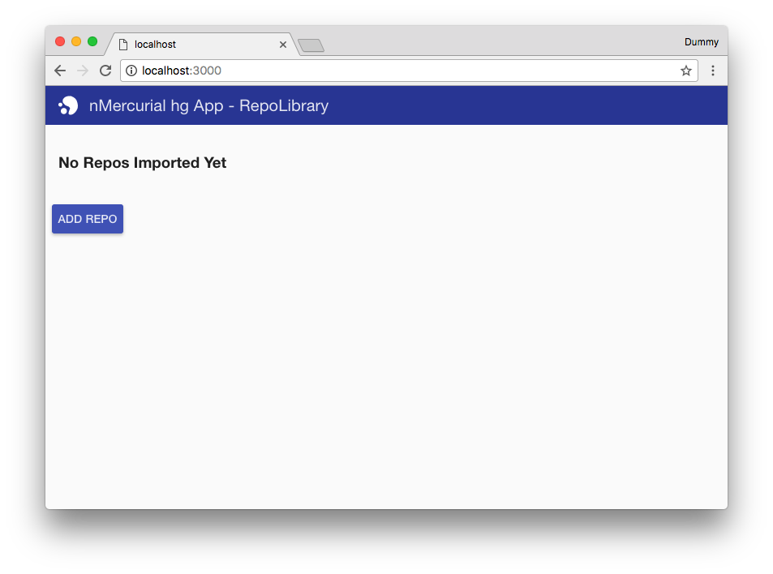

# nMercurial
NodeJS based Mercurial client

Once cloned run the following command to start server:

`npm start`

The server should then be accessible on port 3000

# Docker
To install & run in docker:

`docker run --name nmercurial -p 3000:3000 nikorag/nmercurial`